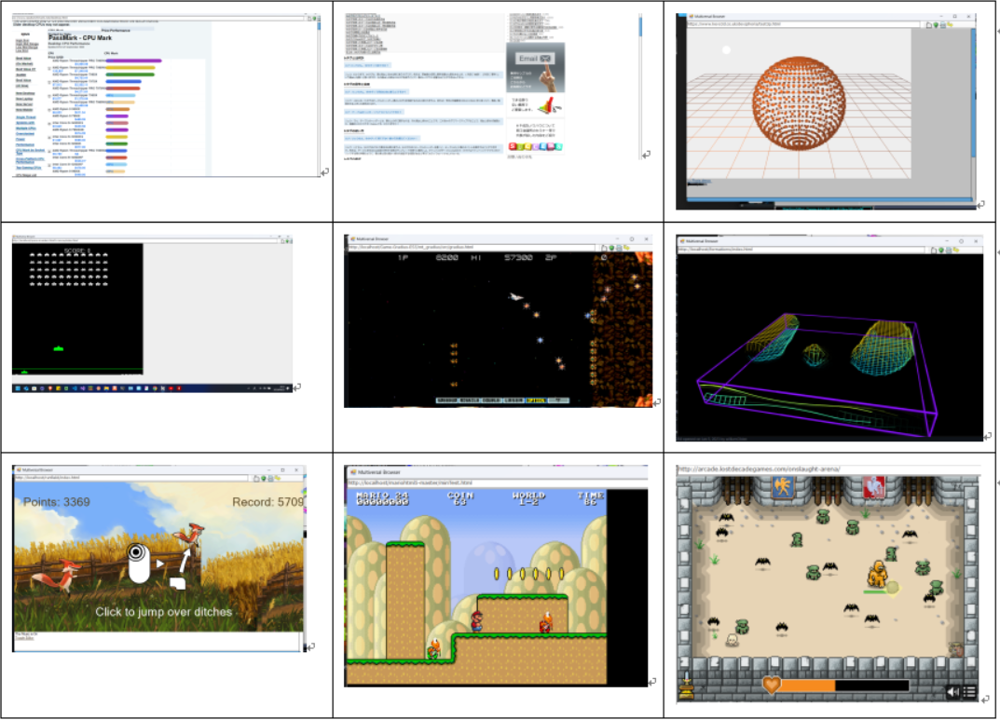

 [WIP] HTML Rendering Library 

## About
HTML Rendering Library for .NET 6 and above [WIP]
- Supports for most of HTML5 Web APIs.
  - Window, HTMLDocument, HTMLElements, HTMLAttributes, etc
  - Most of HTML tags are supported
  - XMLWebRequest
  - basic Windo Events
- CSS3 support
- Javascript (JS5) with Java Rhino Library and IKVM Revived project

## DOM API
- Most of HMLT5 DOM API has been implemented
    - Document.createElement()
    - Document.querySelector()
    - Document.querySelectorAll()
    - Document.getElementById()
    - Documennt.getElementsByClassName()
    - Document.getElementsByTagName()
    - Element.appendChild()
    - Element.removeChild()
    - etc
## Previous Project Screen Image 

## Curent Status
  - The previous project was designed for .NET Framework 1.1 and above and Winforms
  - The migration for Dotnet 6, 7, 8 and above (dotnetcore) is under progress
  - WIP is appproximately 35%.

## TODO

1. Remove existing obsolute Web Client API (WebClient/WebHttpRequest)  code has be re-write to support HtttpClient API
2. Graphical API need to support the latest .NET Cross-Platformm Grahical APIs.
3. HTML layout engine needs a lot of work for improvement. 
4. Impliment better HTML layout scheme.
5. Implement other GUI support other than  Winforms GUI.

